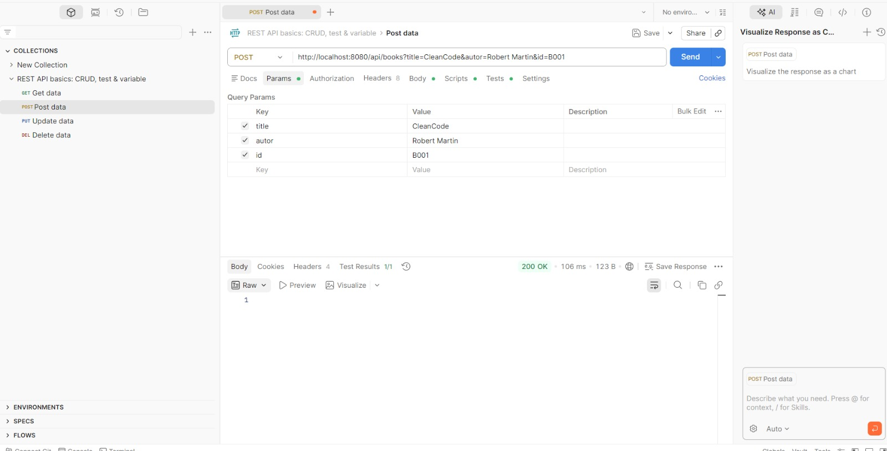
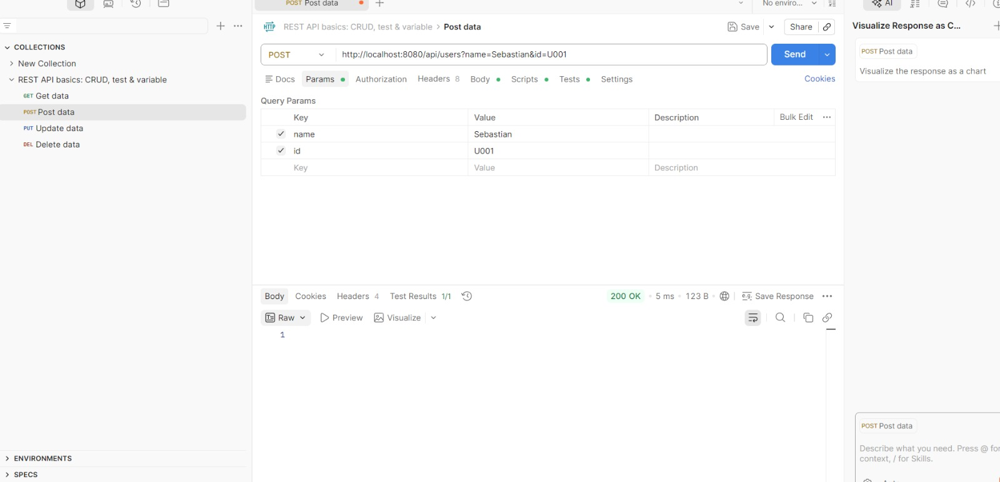
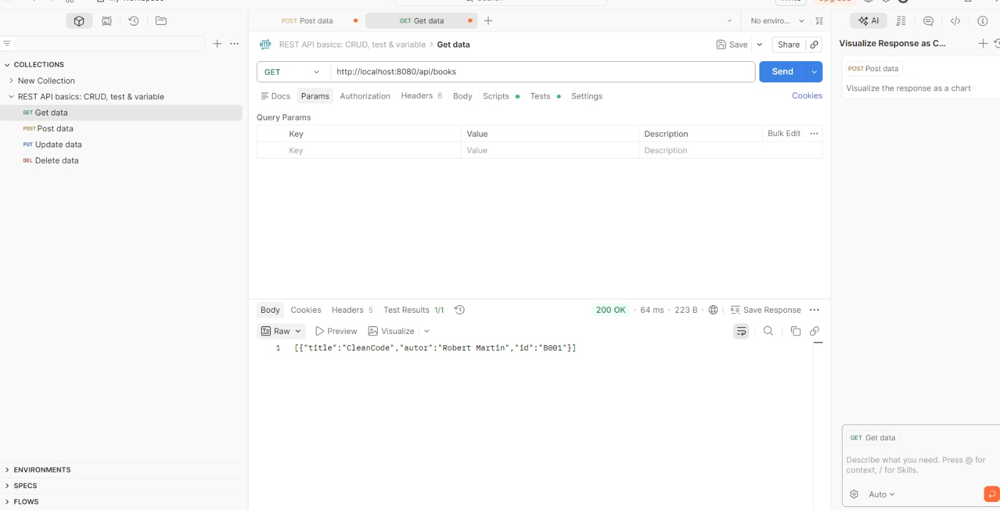
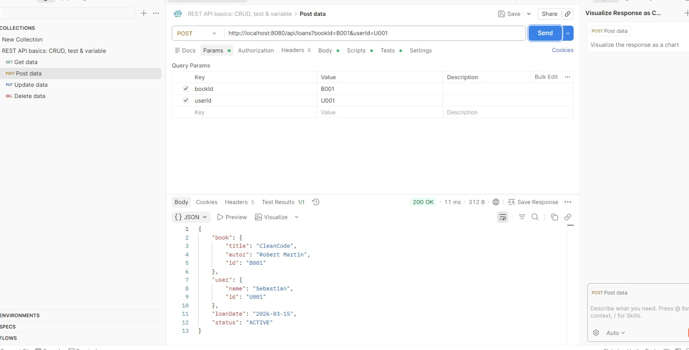
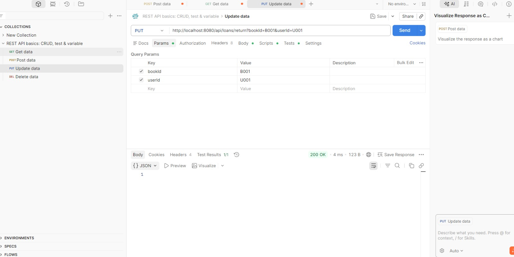

# DOSW-Library

## diagramas

## Ejecucion funcionalidades api

---

---

## ejecución de pruebas de los servicios

## Cobertura y análisis estadísticos

en esta parte me dice que hay dos errores, el primero es que el nombre de"DOWS-Librari 
no deberia estar en mayuscula y la otra es por lo que la covertura esta en 73.3% pero con 
jacoco tenemos 83%, esto es por lo que los mapper y los dtos aun no estan implmentados
